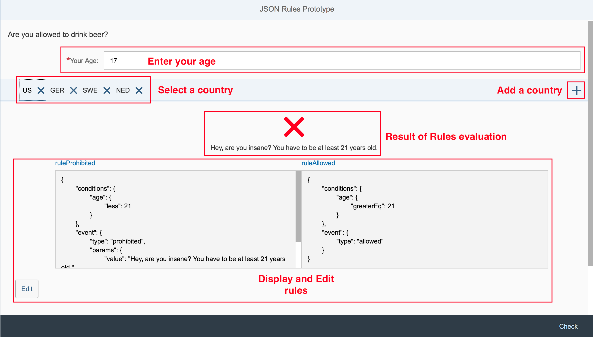

# Frontend Business Rules Engine with UI5
This project is a demonstration for usage of the business rules engine [json-rules-engine-simplified](https://github.com/RxNT/json-rules-engine-simplified).  
A rules engine allows business users to define logic in a simple way. This logic otherwise would have to be implemented by a programmer. Often there are at least two programmers or one programmer with two skills necessary. The backend logic (rules) would hold the logic in database tables (or other storage solutions) and the frontend would retrieve this logic from the backend and implement it at frontend side.

With a business rules engine like [json-rules-engine-simplified](https://github.com/RxNT/json-rules-engine-simplified) the business users can define their business rules in an administration view at the frontend. These rules will then be applied to the frontend at runtine of the application.

## Use cases
A frontend business rules engine can e.g. be used to set
- default values for fields
- set the mandatory property of fields
- set the visible property of fields
- set the editable property of fields
- calculate the VAT for a net price depending on the current browser language
- ...

## Demo application / the business story
For the sake of simplicity this demo application implements neither of the above mentioned use cases.  
It implements the business rule "Are you allowed to drink beer in country ...?". The regulations for drinking beer in general public are different from country to country. 
- In Germany you may drink beer from 16 years on,
- in Sweden you have to be 18 years old and
- in the United States you have to be 21 years old.

Find a running version of the below described Demo application [here](https://ui5-json-rules-engine-simplified.glitch.me/). 

### Your business story
Imagine you wrote an application that shows the users if they are allowed to drink beer.  
So your application offers an input field in which the user can enter their age.
If they are not allowed they get a message that is usual for the country they are requesting. 

When you initially wrote this application you wanted to bring it to the german and the us market. Therefore you implemented a 
```
if( country === "US") { 
	...
	message "Hey, are you insane? You have to be 21 years old"
} else { 
	...
	message "Soon you will be 16 years old and then you are allowed to drink beer"
}
``` 
condition and your application did it's job.  

After some time your app produced interest. Users use it to know if they are allowed to drink beer in countries they plan to travel to.  
But your users not only want to see the regulation for these two countries and they are not happy with your messages they get shown. 
Different users want to see if they are allowed to drink beer for different countries and they want to see a nice and different message for each country.  

Cause you are a real business guy the $-notes blinked in your eyes.  
Unfortunately you aren't aware of all regulations world-wide nor do you want to implement a complicated logic for saving and retrieving the user and language specific messages. 

That's when business rules came on your mind. Let the user create rules for the countries she want's to see in her list. A rule defines from which age you are allowed to drink beer resp. if you are too young. If the rule "You are too young" applies it returns a message.

The user can create new countries in her list and alter the regualtions and the returned message in a way that does not need programing skills.

Wow! Exactly what you were looking for.

### The Demo Application

#### UI
The developed application looks like this.


At the top you see an input field in which the user enters her age.  
Beneath this field there is a TabContainer with one item for each language. If the user clicks at an items text (e.g. US or GER) the below section of the screen changes. In the top area the results of the rule evaluation are displayed, means you see a green check if the `ruleAllowed` fulfills and the `ruleProhibited` didn't succeed. If the `ruleProhibited` succeeded and `ruleAllowed` didn't you see a red cross and the message that is defined in the rules `event->params->value`.

With the `Plus` the user can add a new country that has default rules as long as you do not alter them.

You can edit the rules for the selected country by clicking the `Edit` button and changing the rules text (JSON).

#### Rules
A rule has a `condition` and an `event` part. 
##### Condition 
The `condition` part describes which condition has to be fullfilled to raise the event of the `event` part.  
##### Event
The `event` part defines a `type` and optionally params. When running the rules engine in your code the events for the fulfilled rules are fired. You can write handlers that react on those.  
You can set the `type` to anything you like. So you can e.g. have the types
- enabled / disabled
- visible / hidden
- default with param->value = the default value for a field
- mandatory or required

to realize the use cases I mentioned at the top of this article.  

See the [json-rules-engine-simplified](https://github.com/RxNT/json-rules-engine-simplified) github repository for much more possibilties to define rules.

## Technical implementation

### Rules Engine
To fulfill the requirements I'm using the [json-rules-engine-simplified](https://github.com/RxNT/json-rules-engine-simplified) rules engine that is written for node.js and available on npmjs.org.

#### Using node.js module in browser
node.js modules can't be used directly in browsers cause the node.js module loading mechanism is not implemented by browsers.  
Therefore I decided to use [Browserify](http://browserify.org/) to convert the module with all it's dependencies into a file that can be loaded by browsers.

#### ES6 not supported by all browsers
The rules engine was developed with ES6. Cause this is not supported by all browsers (I needed to support IE 11) I had to transpile the ES6 code to ES5 code.  
Hence I used [Babel](https://babeljs.io/) to get the code that can be run by IE 11.

#### Rules Engine Browser file
The result of the browserifying and babelifying tasks is the file __`webapp/js/json-rules-engine-simplified.js`__. This file not only contains the Rules Engine artifact but also adds a method to the global window object that returns an Engine object (this is the way objects of browserified files can be used outside the file).  
This method is __`window.getRulesEngine()`__.

### Using the Rules Engine
To use the Rules Engine you have to create an instance of it and apply rules to it.
```
/**
	* Generates and returns the rule engine instance that can be used to run against a set of facts
	* @returns {Object} the generated rules engine
*/
_generateRuleEngine: function() {
	// pull the Engine object from the glocal window object
	var Engine = window.getRulesEngine();
	// create a RulesEngine instance
	var ruleEngine = new Engine();

	// apply current rule to the engine instance
	var currentRules = this._getCurrentRules(0);			
	ruleEngine.addRule(currentRules.ruleProhibited);
	ruleEngine.addRule(currentRules.ruleAllowed);
	
	return ruleEngine;
},
```
After you created the rules engine and applied the rules you can run the engine.
```
// create the facts to which the rules are applied 
var facts = {
	age: value
};

// run the rules engine and react to the fired events
this._generateRuleEngine().run(facts).then(function(events) { // run() returns remove event
	var data = this.getView().getModel("dataModel").getData();
	events.map(function(event) {
		switch(event.type) {
			case "prohibited":
				data.beerAllowed = false;
				data.beerForbiddenMessage = event.params.value;
				break;
			case "allowed":
				data.beerAllowed = true;
				break;
		}
	} );
	this.getView().getModel("dataModel").setData(data);
}.bind(this));
```
As you can see we have to pass a `facts` object to which the rules are applied. In our case this object has only one property `age` that gets it's value from the input field in the UI.  
Of course you can imagine that you can feed the `run` method with much more complex objects like e.g. a contract, person object, equipment object, ... that can then be used in the rules.

## Installation and Running
You can install and run the application locally or in `SAP Web IDE`.
The following chapters describe both ways.

### SAP Web IDE
To install the application in SAP Web IDE just clone the git repository. Then you can run the application via the `webapp/index.html` file.

### Local
Node.js with NPM have to be installed at your computer. 
- Clone the git repository
- run `npm install`. This installs 
- run `npm start`
- Open `http://localhost:8080` in your preferred browser.

## Outlook
If you are a consultant/developer like me who tries to make life easier for application users you will say: "Nice, but telling an enduser that he has to define his rules in JSON is not very user friendly".  
You are right. Hence we plan to create a SAPUI5 control or set of controls that enables the user to define the rules in a somehow _graphical_ way. 


